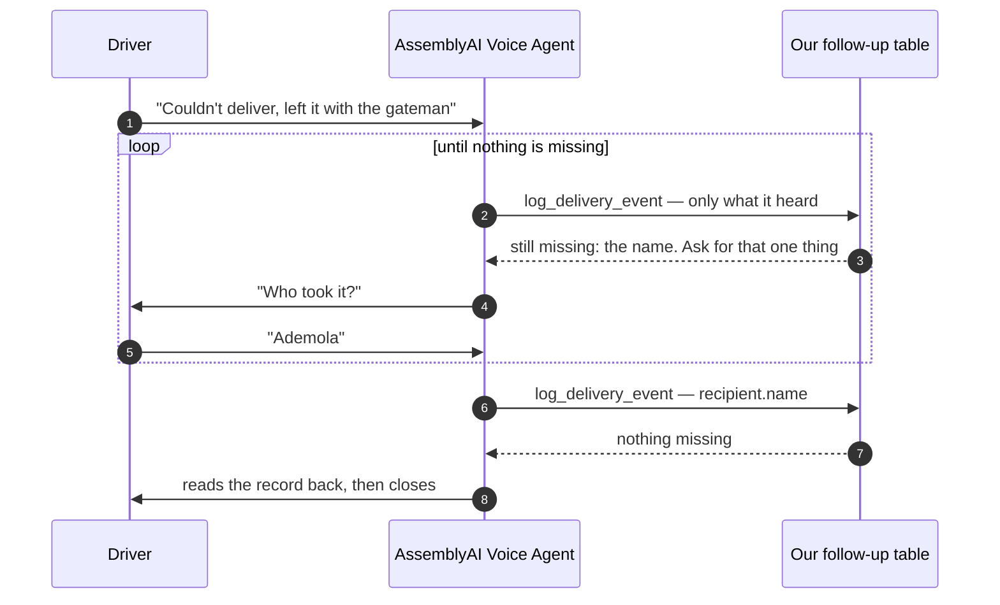
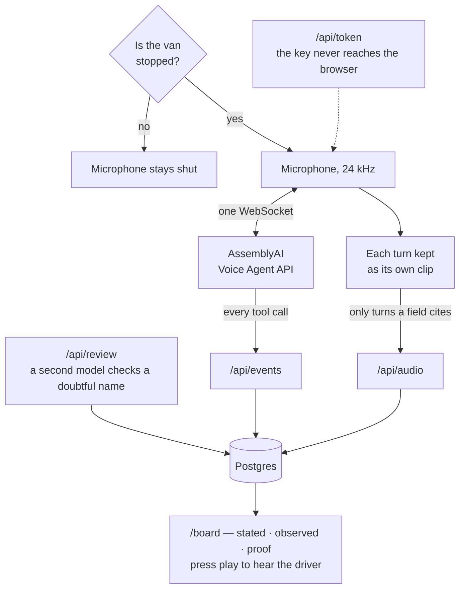

# Lastmile

**Voice-first delivery exception reporting for last-mile drivers.**

A driver finishes a drop and, **while stopped**, says what happened out loud in normal words. The
agent asks only for the details they left out, reads the record back to confirm, and files it. Each
field keeps a link to the driver turn that set it, so a dispatcher can click it and hear the driver
say it.

Built on the [AssemblyAI Voice Agent API](https://www.assemblyai.com/) for the lablab.ai
AssemblyAI Voice Agent Hackathon, September 2026.

**Live:** [lastmile-peach.vercel.app/drive](https://lastmile-peach.vercel.app/drive) ·
[the dispatcher board](https://lastmile-peach.vercel.app/board)

## The claim, measured

Local place names are what a recogniser gets wrong. Each region ships a list of local
terms, handed to the recogniser *before* it listens. We measured what that is worth:
sixty recordings, each transcribed twice, the word list the only difference.

| Region | Voice | Word list off | on | Gain |
|---|---|---|---|---|
| **Lagos** | Nigerian, ours | 65% | **90%** | **+25** |
| **Lahore** | Pakistani, ours | 75% | **85%** | **+10** |
| **London** | synthetic British | 65% | **60%** | **−5** |

*Addresses transcribed fully correctly.* Word error rate in Lagos falls from 7.3% to 1.6%.

**The pack pays most where the vocabulary is furthest from English, and slightly hurts
where the words are already native.** London is in the table because a result that goes
against us is what makes the other two worth believing. Method and every transcript:
[`measurement/RESULTS.md`](measurement/RESULTS.md).

---

## The idea in one paragraph

Delivery drivers hit problems all day: the customer is out, the gate is locked, a neighbour takes
the parcel.

**The outcome usually does get recorded** — the scanner blocks the next stop until the driver taps
something. What does not get recorded is the *narrative*: which lobby, the gateman's name, whether
he signed, why it failed. That is the part a dispute turns on three weeks later, and it is the part
nobody types with a parcel under one arm.

Lastmile captures the narrative. The driver just talks.

**What this is not:** it is not proof of delivery. A driver's recording is a statement by an
interested party. Real proof is scans, photos and signatures, and the existing tools already do
that well. What Lastmile produces is an **auditable exception narrative** that sits next to those
machine-observed facts.

## What makes it an agent, not a voice-driven form

The agent does not ask a fixed list of questions. **Our code works out what is still missing and
tells the agent, on every turn.**

A driver says *"customer wasn't in, left it with the concierge."* That already gives us the
outcome and who took the parcel, so the agent asks two things: which entrance, and the concierge's
name. If the driver had already said the gate, it asks one. If they said everything in one breath,
it asks nothing and goes straight to confirming.

Nothing in the prompt changes to make that work. See [`docs/architecture.md`](docs/architecture.md)
§5 for the control loop and a full worked example.

## Safety first, and it is not a slogan

**The agent will not open a session unless the vehicle is stationary.**

A multi-turn conversation with a moving driver is a liability no fleet safety officer will sign
off, hands-free or not. So the product is **park, speak, go**. Above a low speed threshold the
screen says "Waiting until you've stopped" and the microphone stays shut.

This also happens to be the engineering answer. A dash-mounted phone holding a live microphone
socket in a moving car is the worst case for a mobile browser. A stopped driver holding a phone
for twenty seconds is the easy case.

## Three kinds of evidence, kept apart

| Column | Comes from | Example |
|---|---|---|
| **Stated** | the driver's words | "left it with the concierge, main lobby" |
| **Observed** | the device | time, coordinates, 300m from the drop address, vehicle stationary |
| **Proof** | the recipient | signature, photo, one-time code (declared, not built) |

Only the stated column is ever asked for. This is what makes the GPS distance honest: "driver said
main lobby" next to "300m away" is not an accusation, it is two independent columns and a
dispatcher who can now decide.

Any field the recogniser is unsure about marks the record **needs review** rather than being
accepted silently.

## It works in more than one country

Address conventions are loaded as **data, not code**. A region pack holds the local vocabulary —
street and estate names, how people say entrances, the landmarks everyone navigates by — and those
terms are given to the speech recogniser before it listens, so it stops mangling them.

Three packs ship: **UK / London**, **Nigeria / Lagos**, **Pakistan / Lahore**.

Swapping the pack retargets the product to a new market without touching the schema, the
follow-up logic, or the agent.

---

## Architecture in short

### The loop, which is the product

The agent is never told what to ask. Our code works out which fields are still
empty and hands it that list on every single turn.



Say all of it in one breath — *"left it with Ademola the gateman at the black gate"* —
and the first answer is already "nothing missing", so it asks nothing. No prompt
changes to make that happen.

### Where things run



**Stack:** Next.js on Vercel · Postgres · two routes, `/drive` and `/board`.

Three things worth knowing up front, because they are the decisions people ask about:

- **One agent, not many.** A driver reporting one delivery is a short exchange with one
  participant. There is no second role for a second agent to play.
- **No RAG.** There is no corpus here — a 12-row manifest, a five-value enum and a word list.
  Keyterm biasing fixes local place names *at the recogniser, before it listens*, which retrieval
  cannot do. Full reasoning in `docs/architecture.md` §4.
- **One voice surface, not two.** The driver talks. The dispatcher board is read-only and updates
  by itself. Voice control of the board was cut on purpose — it is a filtering problem wearing a
  microphone and it shares no logic with the loop that matters.

---

## Quickstart

Thirty seconds to a talking agent, if you have an AssemblyAI key.

```bash
git clone https://github.com/PegBitStudio/lastmile && cd lastmile
npm install
```

Put your key in `.env.local`, which git ignores:

```
ASSEMBLYAI_API_KEY=your_key_here
```

Create an agent for each region. The command prints an id; each one goes in the same file:

```powershell
$env:REGION="ng-lagos";  npm run agent:create   # -> NEXT_PUBLIC_AGENT_ID_NG_LAGOS
$env:REGION="pk-lahore"; npm run agent:create   # -> NEXT_PUBLIC_AGENT_ID_PK_LAHORE
$env:REGION="uk-london"; npm run agent:create   # -> NEXT_PUBLIC_AGENT_ID_UK_LONDON
```

Then:

```bash
npm run dev     # http://localhost:3000/drive
```

Press **Report a drop** and say *"couldn't deliver, left it with the gateman"*.

`DATABASE_URL` is optional. Set it to any Postgres and records reach
[`/board`](https://lastmile-peach.vercel.app/board); leave it out and the app still runs,
and says so. Tables are created on first write.

```bash
npm test        # 133 tests, no network needed
```

**Never commit the AssemblyAI API key.** The browser gets a short-lived token minted by a server
route. The key stays on the server.

**One billing note for anyone running this:** streaming sessions are billed on **how long the
WebSocket is open**, not how long anyone is speaking. Close it in a `finally` block. A forgotten
browser tab costs real money.

---

## Documentation

| File | What it covers |
|---|---|
| [`docs/lastmile-spec.md`](docs/lastmile-spec.md) | What we are building. Schema, follow-up table, region packs, tools |
| [`docs/architecture.md`](docs/architecture.md) | How it works. The control loop, the LLM choice, why there is no RAG |
| [`docs/learning-log.md`](docs/learning-log.md) | What we learned while building, one line at a time |
| [`docs/slides.md`](docs/slides.md) · [`slides.html`](docs/slides.html) | The deck, and the printable version of it |
| [`docs/video-script.md`](docs/video-script.md) | The demo video, beat by beat |
| [`docs/recording-plan.md`](docs/recording-plan.md) | Who records what, in what order, and with what settings |

## What we learned about the Voice Agent API

Twenty-two notes written as they happened, in
[`docs/learning-log.md`](docs/learning-log.md). The ones we would want to have been told:

**Billing is on connection time, not speech.** A forgotten browser tab costs money. Every
path out of a session ends in `close_session`, including a `pagehide` listener.

**Agents are created by API, not in a dashboard.** `POST /v1/agents`, and update is `PUT` —
`PATCH` is refused. That turned out to be a gift: the prompt lives in
[`agents/driver.json`](agents/driver.json), in git, and changes show up in a diff.

**Keyterms live on the agent, not the session**, capped at 100. So switching region means
switching agent. We run one per country rather than rewriting the agent mid-route.

**`turn_detection` defaults are tuned for a quiet room.** Left null, the agent cut the
driver off mid-address. Raising `vad_threshold` and `min_silence` is what makes a noisy
street usable — see the values in `agents/driver.json`.

**Browser tokens are single use and last 60 seconds.** Fetch one immediately before opening
the socket, not once at page load.

**The transcript arrives as plain text with no confidence score.** To flag a doubtful name
we re-transcribe the cited turn with a second model and compare — `/api/review`.

**Keyterms can make recognition worse.** London scored 60% with the pack against 65%
without. Biasing towards words the model already knows pulls correct guesses off course.

**Without keyterms, two Lahore addresses came back in Devanagari.** The recogniser
switched language rather than mis-spelling a word. Forcing the locale fixes it — and a
scorer that does not expect it will silently record a zero.

## Team

- **Dami** — the agent and the app
- **Yashfa** — the region packs and the recognition measurements

## Licence

MIT. See [LICENSE](LICENSE).
